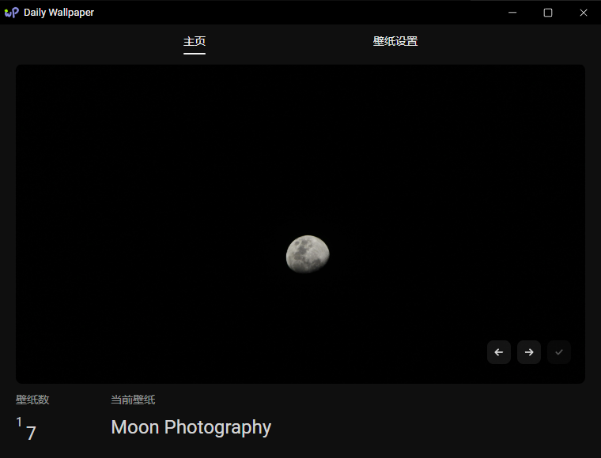
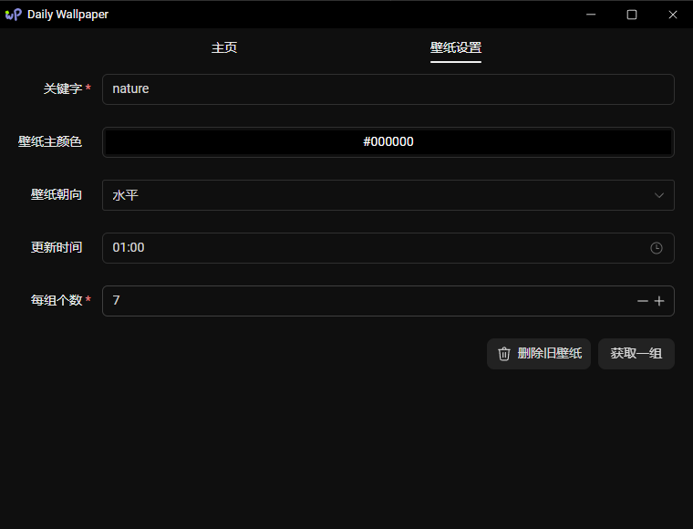

# Daily Wallpaper

## 功能特点

- 🚀 基于 Tauri 2.0 构建
- ⚡️ Vue 3 + TypeScript + Vite
- 📦 Pinia 状态管理
- 🎨 UnoCSS 原子化 CSS
- 🔥 热更新开发
- 🔒 安全的跨平台特性

每天定时更换壁纸，新壁纸会从[Pexel](https://www.pexels.com/)下载，可自定义壁纸风格。

ONLY FOR WINDOWS

## 注意

软件打开默认最小化到托盘

## 界面

